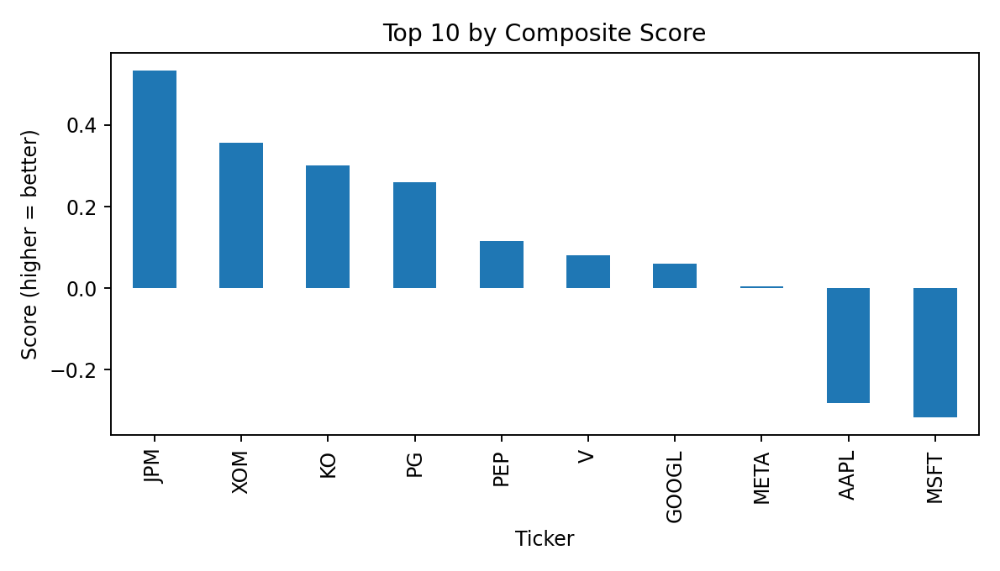
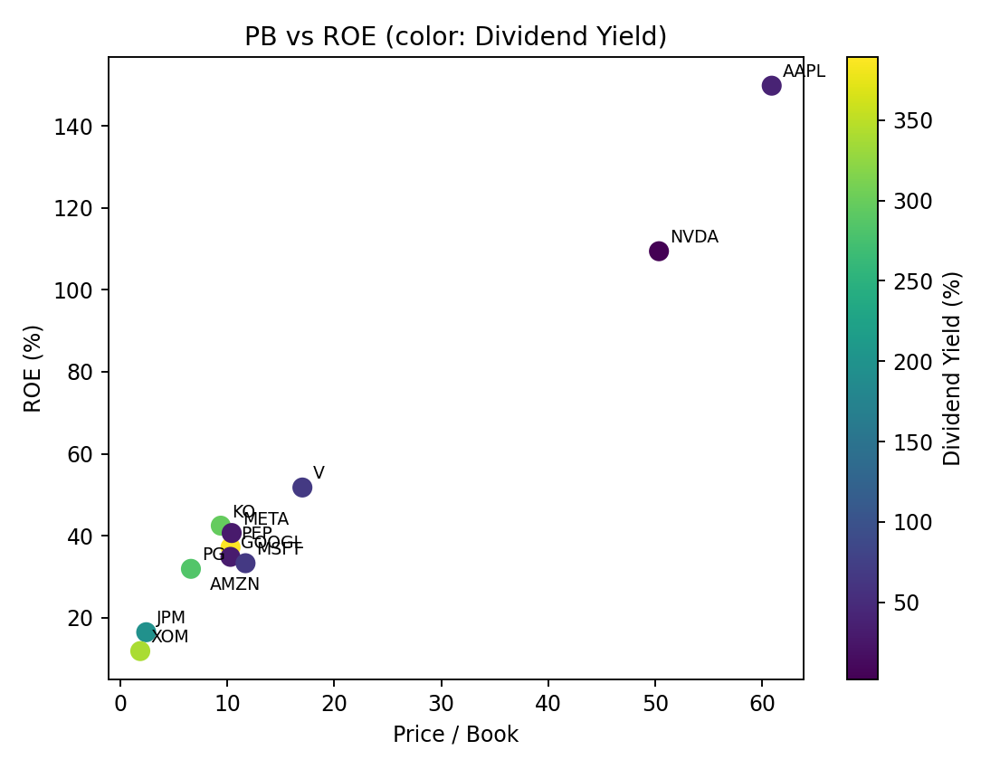
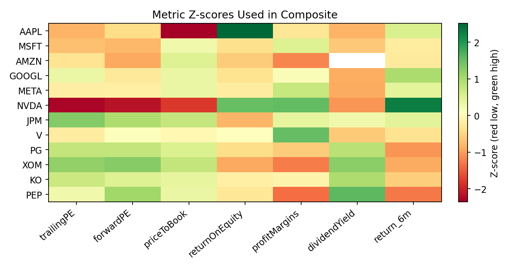

# Stock Screener & Valuation Dashboard

A Python-based dashboard that ranks large-cap US stocks using valuation, quality, and momentum factors.  
It calculates key financial ratios, creates composite scores, and visualizes results in professional charts.

---

## Features
- Fetches real-time financial data from Yahoo Finance
- Calculates key metrics:
  - Price/Earnings (P/E)
  - Price/Book (P/B)
  - Return on Equity (ROE)
  - Profit Margins
  - Dividend Yield
  - 6-Month Price Momentum
- Computes z-scores and combines them into a composite ranking
- Generates visualizations:
  - Top 10 Stocks by Composite Score
  - P/B vs ROE Scatter (colored by Dividend Yield)
  - Metric Z-score Heatmap
- Exports outputs to `.csv` and `.png` for easy reporting

---

## Tech Stack
- Python: pandas, numpy, yfinance, matplotlib, seaborn  
- Environment: Jupyter Notebook / VS Code  
- Data Source: Yahoo Finance API  

---

## Example Outputs

| Visualization | Description |
|----------------|--------------|
|  | Top 10 stocks ranked by composite z-score |
|  | Valuation vs profitability (color = dividend yield) |
|  | Metric z-scores across all tickers |

---

## 🚀 How to Run

### 1️⃣ Install dependencies:
```bash
pip install yfinance pandas numpy matplotlib seaborn
